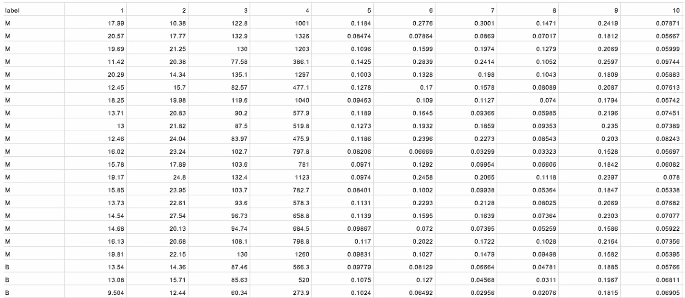
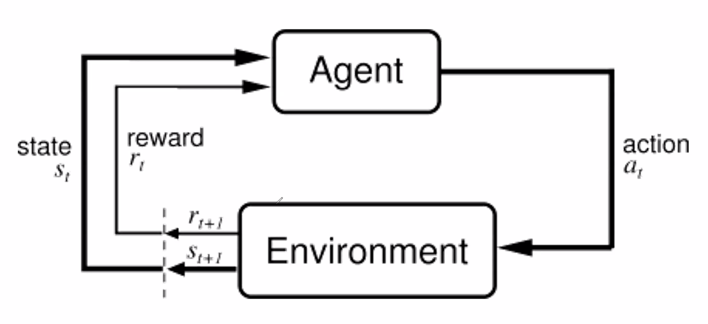
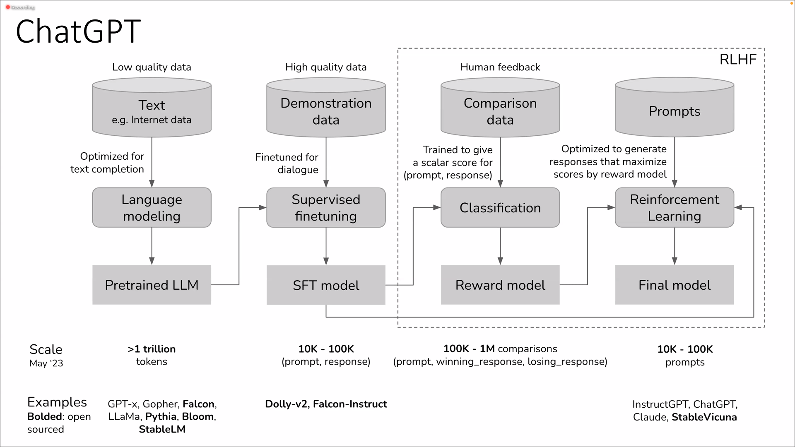

<!-- 2024/09/09 -->
# типы машинного обучения

## задача

**задача**: хотим определять, рак или не рак у пациента по биопсии его клеток.
B (benign) – хорошо, M (malignant) – плохо.

посчитали какие-то **средние показатели для клеток**:

1. радиус
2. текстура
3. периметр
4. площадь
5. гладкость
6. компактность
7. вогнутость
8. симметрия
9. ... (всего 30 параметров)

**пример таблички (датасета):**

большая часть машинного обучения – по некоторым данным (в данном случае, знаем, был или не было по итогу у пациентов рак) и результату делать предсказание для новых данных.

## обучение с учителем, supervised learning

«учитель» для каких-то примеров сказал нам ответ.

$$
\begin{align*}
\text{input:} & \quad \mathbf{X} \\
\text{output (label):} & \quad y \\
\text{target function:} & \quad f: \mathbf{X} \rightarrow \mathbf{Y} \\
\text{data:} & \quad (\mathbf{x}_1, y_1), (\mathbf{x}_2, y_2), \ldots, (\mathbf{x}_N, y_N) \quad \text{(некоторая целевая функция, «учитель»)} \\
\text{hypothesis:} & \quad h: \mathbf{X} \rightarrow \mathbf{Y} \quad \text{(то, что хотим вывести)}
\end{align*}
$$

обычно занимаемся **одной из двух задач**:

- *задача классификации* – $y$ принадлежит какому-то множеству классов.
- *задача регрессии* – $y$ является числом или вектором.

## нотация

- $\mathbf{D}=[\mathbf{x}_1, ..., \mathbf{x}_n]$
  
  *данные, data* – набор векторов.
- $\mathbf{x} =[x_1, ..., x_k]$
  
  вектор – набор фичей.

  *фичи (признаки), features (value)* – обычно числа, реже – слова.

## обучение без учителя, unsupervised learning

есть какие-то данные, но результат неизвестен.

$$
\begin{align*}
\text{Input: } & \mathbf{X} \\
\text{Data: } & (\mathbf{x}_1), (\mathbf{x}_2), \ldots, (\mathbf{x}_N)
\end{align*}
$$

**цели:**

- выяснение информации
- выяснение зависимостей среди данных.
- уменьшение размера данных.

## обучение с частичным привлечением учителя, semi-supervised learning

для каких-то данных есть учитель (то есть знаем результат), а для каких-то – нет.

## активное обучение (active learning)

разметить все нельзя (не хватит бюджета), но можем разметить что-то частично (то есть для некоторых данных можем узнать ответ учителя).

## обучение с подкреплением, reinforcement learning

динамичная вещь, за правильное действие выдается награда (она может быть как положительной \[поставил мат в шахматах\], так и отрицательной \[тебе поставили мат\]).

### пример

в чат гпт есть все способы машинного обучения:

- чтение текста – обучение языковой модели (pretrained LLM).
- получение ответов на вопросы – генерация качественных вопросов и ответов (SFT model).
- оценка ответов – модель награждения (reward model).

## instance based learning

**задача:** предсказать для следующего.

**решение:** самый простой способ – найти похожее.

*instance based learning* – давайте найдем самое похожее, будем считать некоторый вес (зависит от похожести/расстояния) и просуммируем по всем веса.

$$
h(\mathbf{x}; D) = \arg\max_{y \in Y} \sum_{x_i \in D} [y_i = y] w(x_i, \mathbf{x})
\\
\Gamma_y(\mathbf{x}) = \sum_{x_i \in D} [y_i = y] w(x_i, \mathbf{x}) \\
\text{where } w(x_i, \mathbf{x}) \text{ is the weight of } x_i \text{ for } \mathbf{x},\
\Gamma_y(\mathbf{x}) \text{ is the affinity of } \mathbf{x} \text{ to class } y
$$

решение – выставляем для самой близкой точки 1, для остальных ноль, тогда $\Gamma_M(x)=1$ и $\Gamma_B(x)=0$.

## метод kNN, k-ближайших соседей

метод классификации.

$$
h(\mathbf{x}; D) = \arg\max_{y \in Y} \sum_{x_i \in D} [y_i = y] w(x_i, \mathbf{x}) \\

w(x_i, \mathbf{x}) =
\begin{cases}
1, & \text{if } x_i \text{ is one of the k nearest neighbors of } \mathbf{x} \\
1, & \text{if distance } \rho(x_i, \mathbf{x}) < R \text{ (Radius Neighbors)}
\end{cases}
$$

**важно:** нам нужна какая-то функция соседей, не нужно векторное пространство (например, для строк его вообще нет, но расстояние посчитать можем), важно только расстоянии.

если близости одинаковы – обычно берут по алфавиту.

## ошибки

метрика качества классификатора (например, подбора $k$ и проверки результата в случае kNN).

1. *leave-one-out-error*:

   $LOO(k, D)=\frac{\sum\limits_{x_i\in D}[h(x_i; D \setminus x_i; k)\neq y_i]}{|D|}$

   считаем долю ошибок.
2. *train / test*

   возьмем 10-20% датасета и выкинем данные (предположим, что не знаем ответ) – *test dataset*. оставшийся датасет – *training dataset* (на нем обучаемся).

   оптимизируем гиперпараметры (например, число соседей), смотря на корректность на *тестовом датасете*.

   если гиперпараметров много, то можно добавить еще один валидационный датасет.
3. *train / validate / test*.

   10-20% датасета – *test dataset*, 10-20% датасета – *validate dataset*. оставшийся датасет – *training dataset*.

   оптимизируем гиперпараметры (например, число соседей), смотря на корректность на *валидационном датасете*.

   проверяем на тестовом датасете (или выбираем на нем классификаторы). при этом чем мы чаще в него смотрим, то тем больше «подгоняем» результаты под него.
4. *сross-validation*.

   проводим эксперимент на разных частях датасета. считаем ошибку в каждом эксперименте и получаем среднюю.

   используется редко, в основном, когда данных мало.

## метод WkNN, Weighted kNN

если хотим, например, увеличить влияние ближайших точек, то добавляем веса (вместо функции в {0, 1} добавляем функцию, зависящую от расстояния). так можно избавиться от неопределенности.

**различные функции для веса:**

$$
w_i = \left[\frac{r - \rho(\mathbf{x}, x_i)}{r}\right]_+ \quad \text{ – Triangle kernel} \\
$$
$$
w'_i = q^{-\rho(\mathbf{x}, x_i)} \quad \text{ – Gaussian kernel}
$$

**метод окна Парцена:**

устанавливаем окно фиксированной ширины и смотрим на ядра.

$$
w(\mathbf{x}, x_i) = K\left(\frac{\rho(\mathbf{x}, x_i)}{r}\right) \quad \text{ – fixed width} \\
w(\mathbf{x}, x_i) = K\left(\frac{\rho(\mathbf{x}, x_i)}{\rho(\mathbf{x}, x_j)}\right), \text{ where } x_j \text{ is the (k+1)st neighbor} \quad \text{ – kNN width}
$$
