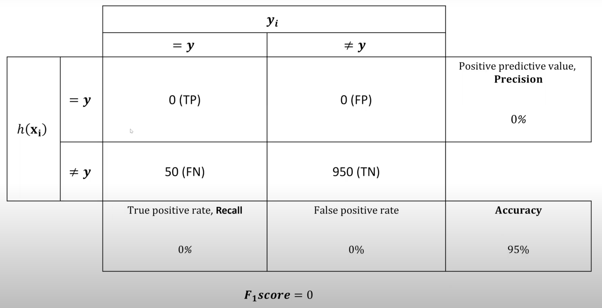

<!-- 2024/09/23 -->
## оценивание классификатора, classifier evaluation

описывает отношения таблица, в которой отражено, что может произойти с классификатором:

$y_i$ – реальный класс точки $i$.

$h(\mathbf{x}_i)$ – гипотетический класс точки $i$.

$TP$ – точка действительно принадлежит классу и гипотеза верна.

$TN$ – точка действительно *не* принадлежит классу и гипотеза верна.

$FP$ – отнесли к положительному классу, а на самом деле принадлежит отрицательному.

$FN$ – отнесли к отрицательному классу, а на самом деле принадлежит положительному.

**метрики:**

- *точность (аккуратность), accuracy* – доля точно предсказанных значений.

  из примеров – частота раковых клеток 0.01, здоровых 0.99, для классификатора «все клетки – здоровые» точность составляет 99%. но при этом хороший ли классификатор? кажется, что нет, поэтому нельзя рассматривать метрику в отдельности без других.

- *точность-2 (прецензионность), precision* – доля точек положительного класса среди всех положительно классифицированных точек.

- *полнота, recall* – доля точек положительного класса среди всех действительно положительных точек.
  
  часто смотрят в совокупности с precision.

- false positive rate – доля точек отрицательного класса среди всех действительно отрицательных точек.

обычно хотим TPF и precision побольше, а FPR – поменьше.

$F_1score$ – среднее гармоническое полноты и точности.

*trashhold* – выставление некоторой границы уверенности по precision или recall, после чего следят за максимизацией оставшейся метрики.

### примеры

тут precision 100%.

## эффективность Парето

какие хотим брать классификаторы? серые невыгодно, так как есть классификаторы лучше и по recall, и по precision.

красные – *фронт Парето*.

точка N – второй фронт Парето (несмотря на то, что выше N нет точек, считаем что второй фронт, так как полагаем, что между D и E есть виртуальные точки).

точка K – третий и так далее.

трешхолд повышается, если мы идем вверх.

## Recovering Operating Characteristics (ROP)

1. имеем два классификатора с разными трешхолдами. синий классификатор лучше, чем зеленый (он везде лучше).

   при повышении трешхолда двигаемся вверх по кривой.

2. в левой нижней точке всех отнесли в положительный класс, в правой верхней – всех в отрицательной. в идеале находится в левой верхней точке.

   в целом все, что на диагонали – плохой классификатор.

   есть интегральная характеристика – площадь под roc-кривой (*AUC* – Area Under the ROC Curve). максимальная 1, минимальная 0.5 (меньше не может быть, так как можем поменять местами классы и отразить кривую так, чтобы она была выше диагонали).

   при повышении трешхолда двигаемся вниз по кривой.

### one hot encoding

есть проблема – если считаем евклидово расстояние, то влиять будут только большие фичи. чтобы избавиться от этого, нужно отнормировать: заводим для каждого категориального признака по фиче, убираем отношение порядка, выравниваем евклидово расстояние.

### scalers

меняем масштаб признаков.

- *MinMax Scaler*:

    $$x_{scaled}=\frac{x-\min(x)}{\max(x)-\min(x)}\cdot (\max - \min)+\min$$

    для 0 и 1:

    $$x_{scaled}=\frac{x-\min(x)}{\max(x)-\min(x)}$$

    скейлеры вычисляем только на тренировочном датасете (потому что скейлеры должны быть одинаковыми, а минимум и максимум не для тренировочного мы не знаем).

    $$x_{scaled}^{train}=\frac{x^{train}-\min(x^{train})}{\max(x^{train})-\min(x^{train})}$$

    $$x_{scaled}^{val}=\frac{x^{val}-\min(x^{train})}{\max(x^{train})-\min(x^{train})}$$

    $$x_{scaled}^{test}=\frac{x^{test}-\min(x^{train})}{\max(x^{train})-\min(x^{train})}$$

- *MaxAbs Scaler*:
    $$x_{scaled}=\frac{x}{\max(|x|)}$$

    такой скейлер сохраняет разреженность данных.

- *Standard Scaler*:

    $$x_{scaled}=\frac{x-\text{mean}}{\text{std}(x)}$$

    $\text{std}(x)$ – стандартное отклонение.

- *Robust Scaler*:

    $$x_{scaled}=\frac{x-\text{median}(x)}{\text{percentile}_{\max}(x) - \text{percentile}_{\min}(x)}$$

    если хотим расширить точки между фичами.

    

### проклятие размерности, the curse of dimensionality

чем больше размерность, тем страннее расстояние.

### step-wise (пошаговый) $kNN$

1. выбераем лучший признак $l$:

   $$\rho_L(x', x) = |x'_l - x_l|$$

2. находим лучший признак $l$ и вес:

   $$\rho(x', x) = \rho(x', x) + w_l |x'_l - x_l|$$

3. повторяем шаг (2), пока ошибка LOO или ошибка валидации уменьшаются (или точность увеличивается).

так побеждаем проклятие размерности.

### k-d tree

### prototype section methods taxonomy

$$h(x; \Omega) = \arg\max_{y \in Y} \sum_{x_i \in \Omega} [y_i = y] \cdot w(x_i, x)$$

уменьшаем количество соседей с, например, миллиона до ста.

### (Decremention Reduction Optimization Procedure) DROP5

начинаем с полного датасета.

сортируем точки по сходству с ближайшим неправильным классом.

сортируем в возрастающем порядке.

удаляем точку x, если она не увеличивает ошибку LOO для точек, для которых она считается ближайшим соседом.
