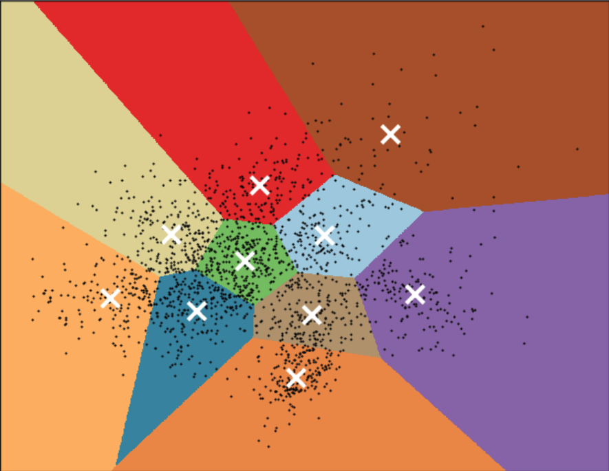
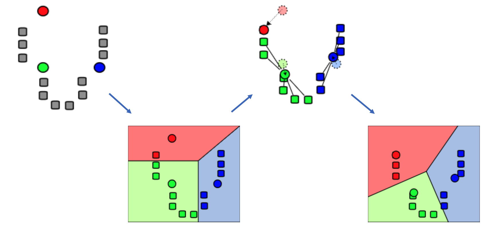
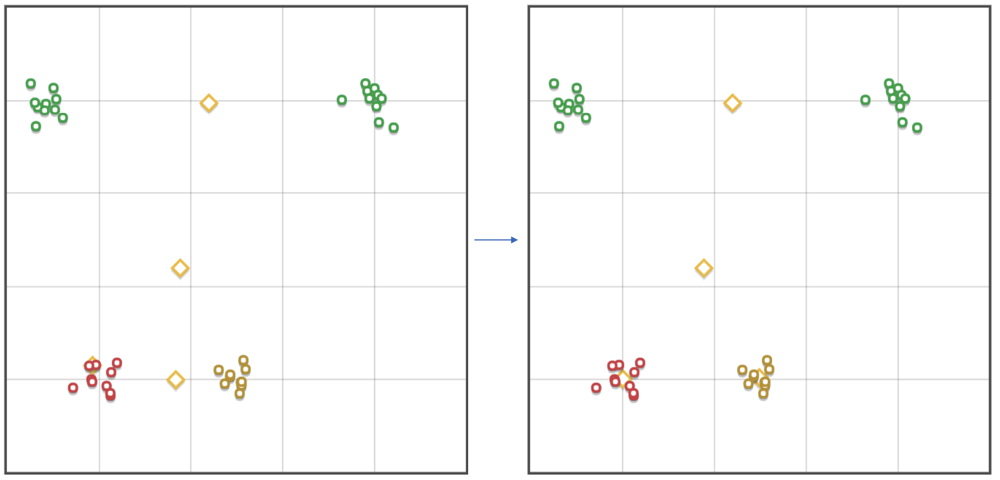
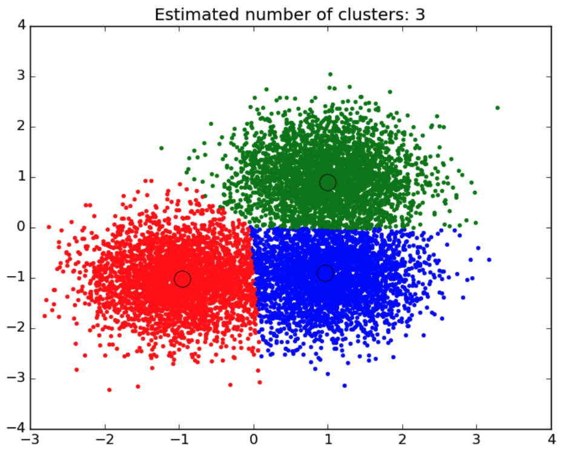
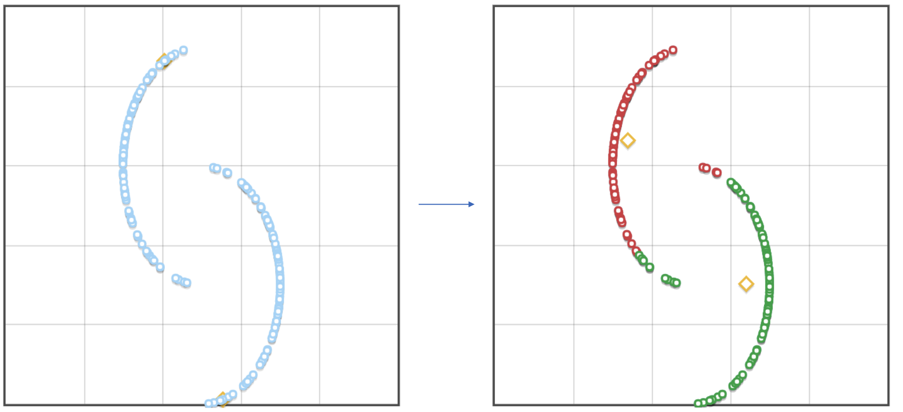
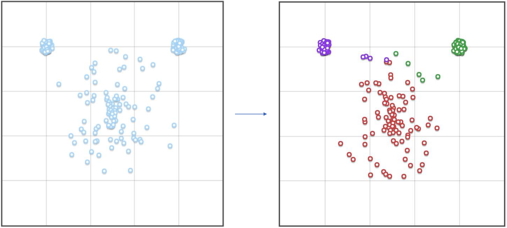
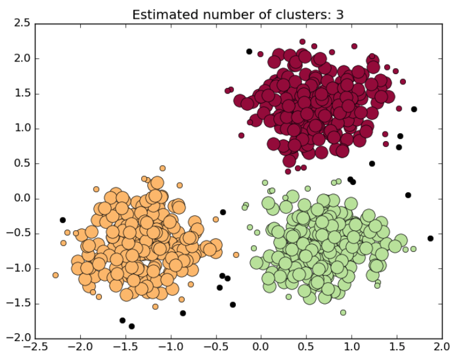
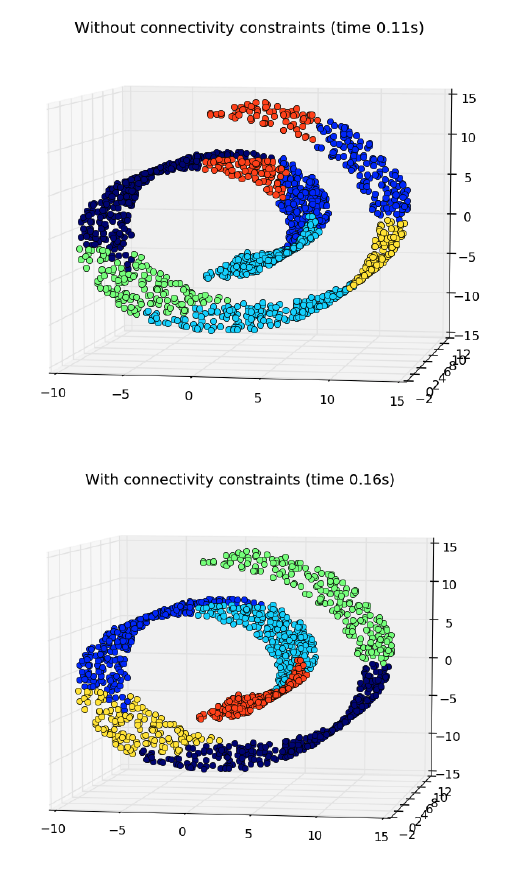
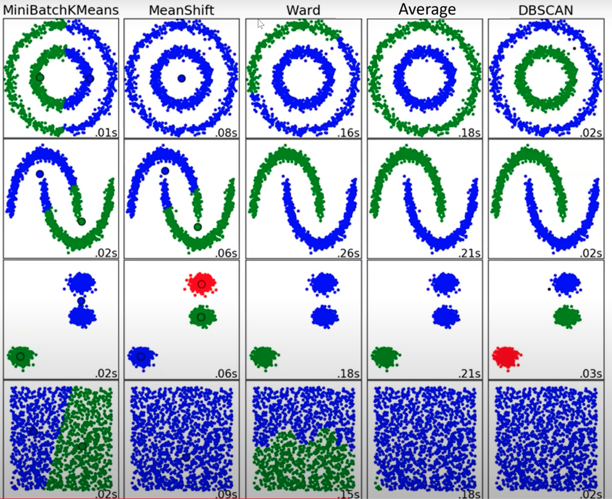

<!-- 2024/09/30 -->
# кластеризация

## зачем?

- выжимка информации.
- создание иерархии объектов.
- упрощение данных для дальнейшего анализа.
- сжатие данных.
- детекция аномалий.
- генерация признаков: добавление фичей, которые показывают строение пространства данных.

## кластеризация – без учителя

- нет четко поставленной задачи.
- не задано число кластеров.
- нет явного критерия качества/метрики.

## K-means (K-средних)

число кластеров заранее задано – $k$. сам кластер задается через координату центроида, $\mu_i$ – центр (центроид) кластера $C_i$.

точки относятся к кластерам по ближайшим центроидам.

пространство делится серединными перпендикулярами по нескольким точкам – *диаграмма Воронова*.

**цель** – найти центры так, чтобы минимизировать разброс: $\sum\limits_{x_j\in X}\min\limits_{\mu_i}\bigg| |x_j - \mu_i| \bigg|_2^2$

### алгоритм K-means

1. рандомно инициализируем точки центров кластера.
2. помечаем точки по принадлежности к кластерам.
3. сдвигаем центр в центр масс: $\mu_i =\frac{1}{|C_i|}\sum\limits_{x_j\in C_i} x_j$
4. повторяем 2-3 до схождения.

### проблемы K-means

- выбор правильного количества числа кластеров (этим алгоритмом нельзя узнать количество кластеров – сколько мы зададим, столько и найдем).
- инициализация центров – можем получить не совсем ожидаемые кластеры, например, какому-то ничего не достанется. одно из решений – брать не просто рандомные точки, а рандомные точки из датасета, но это тоже не всегда поможет.

## K-means++

чтобы бороться с проблемой инициализации, придумали k-means++.

### алгоритм K-means++

1. первая центроида выбирается случайно среди данных точек.
2. расстояние пересчитывается пропорциально ближайшего центра (а он один) – $M(x)$.
3. выбираем следующий центр с вероятностью пропорционально $M^2(x)$.
4. повторяем 2-3 $(k-1)$ раз.
5. запускаем k-means.

## mean shift

все еще получаем центроиды и диаграмму Воронова. но здесь у нас уже количество точек не определенно.

изначально в каждую точку кладем центроиду.
$$
\mu_i^0 = x_i
$$

дальше мы все еще смещаем центроиду в центр масс, только масса здесь определяется расстоянием до центроида ($RBF$).

$$
\mu_i^{t+1}=\frac{\sum\limits_{x_j\in N(\mu_i^t)} RBF (x_j-\mu_i^t)x_j}{\sum\limits_{x_j\in N(\mu_i^t)}RBF (x_j-\mu_i^t)}
$$

$N(\mu_i^t)$ – соседи $\mu_i$.

*Radial Basis Function:* $RBF(x_j-\mu_i^t)=
e^{-c||x_j-\mu_i^t||^2_2}$

по итогу центроида смещается в область большей плотности. повторяем до сходимости.

### что хорошо

- не задано количество кластеров.
- есть коэффициент $c$, меняя который, можем менять количество кластеров.

### что плохо

- все еще диаграмма Воронова.
- $\mu_i^{t+1}$ считать много раз и очень долго.
- нужно векторное пространство.

### проблематичные кластеры

- сферические кластеры.

  

- кластеры разных размеров.

  

## DBSCAN (Density-Based Spatial clustering of Applications with Noise)

- число точек изначально не задано.
- *ядерные точки* – точки, содержащие хотя бы $m$ соседей в их $\varepsilon$-окрестности.
- добавляем ядерные точки, объединяем по окрестностям, оставшиеся – аномалии.
- здесь уже не нужно векторное пространство: зная, как вычислять расстояние, можем посчитать количество точек в окрестности.

первый алгоритм, где начинаем получать аномалии – не все точки могут быть отнесены к кластерам.

### проблемы DBSCAN

- две большие проблемы – два гиперпараметра. нам надо откуда-то знать значения $\varepsilon$ и $m$ – их изменение может значительно изменить результат.

# иерархическая кластеризация

## аггломеративная кластеризация

начинаем снизу вверх – каждая точка = свой отдельный кластер. дальше начинаем объединять точки кластеров. есть три стратегии объединения, связанных со своими метриками:

- *ward* – дисперсия
- *average* – среднее расстояние между точками кластеров. объединяем те, у которых это среднее расстояние меньше всего.
- maximum (complete) - максимальное расстояние между точками кластеров.

результат алгоритма – некоторое дерево из кластеров, идем снизу вверх до корня. при этом результат не однозначный, мы можем получить $k$ кластеров разными способами, нам доступны все варианты.

чтобы получить нижнюю картинку вместо верхней, вводится *ограничение на связность (connectivity constraint)* – хотим, чтобы объединяемые кластеры были связными (минимальное расстояние между точками кластера $< \varepsilon$ (некая заданная константа), то есть кластеры близки друг к другу, касаются). но может выйти так, что все кластеры находятся на расстоянии $\geq \varepsilon$, то есть можем не придти к одному кластеру.

## сравнение алгоритмов

### Алгоритмы

1. **MiniBatchKMeans:** быстрая версия K-Means, подходит для больших наборов данных, но плохо справляется с кластеризацией сложных форм, как видно на первых двух рядах.
2. **MeanShift:** алгоритм перемещения среднего, хорошо справляется с кластеризацией в сложных формах, но может иметь высокое вычислительное время.
3. **Ward:** иерархическая агломеративная кластеризация, подходит для сферических кластеров, работает медленно на больших данных.
4. **Average:** также иерархическая кластеризация, аналогична Ward, но использует другой критерий слияния кластеров.
5. **DBSCAN:** хорошо обрабатывает данные с шумом и сложными формами кластеров, как видно на двух первых рядах, где выделены кольцевые и изгибные структуры.

- MiniBatchKMeans и MeanShift показывают быстрое выполнение, но не всегда точные результаты на сложных формах.
- Ward и Average подходят для более простых и компактных структур, но медленные.
- DBSCAN демонстрирует высокую эффективность в обнаружении сложных форм, но может быть медленным на больших данных.

## метрики кластеризации

### внешние метрики (external)

не решаем задачу кластеризацию, как она есть, а решаем задачу, например, классификации.

- *конечная матрика (end metric)*

  есть какая-то задача, конечная цель которой – заработать больше денег. с такой позиции настраиваем различные параметры кластеризации, чтобы получить лучшие метрики (то есть знаем, какого результата хотим достичь, можем поверить уровень качества результата).

следующие метрики анализируют распределение классов по кластерам:

- rand score
- mutual information
- homogeneneity score

  $$\frac{1}{|D|} \sum_i \max_y \left| x_j \in C_i, y_j = y \right|$$

  доля максимального класса в кластере.
  
  - идеальный результат – 1 (но такое верно, когда каждая точка в своем кластере).
  - самая плохая метрика для $2$ кластеров – $\frac{1}{2}$, $\frac{1}{3}$ для $3$ классов – $\frac{1}{n}$ для $n$ классов.
  - стремится к 1, но достигается в $n$. поэтому ищутся точки перегиба.
  - хотим побольше.

### внешние метрики (internal)

у нас ничего нет, только точки, которые хотим кластеризовать.

- *Silhouette Coefficient (Коэффициент Силуэта)*
  
    $$s = \frac{b - a}{\max(a, b)}$$

  - $a$ — среднее расстояние от точки до всех других точек в том же кластере.
  - $b$ — среднее расстояние от точки до всех точек в ближайшем кластере.

  хотим, чтобы:
  - $a$ было поменьше (чтобы кластер был поплотнее).
  - $b$ было побольше (чтобы кластеры были подальше друг от друга).
  - $s$ было побольше.

  если каждая точка в своем кластере, то $a=0$, $s=1$.
- *Dunn Index (Индекс Данна)*

  $$D = \frac{\min\limits_{i \neq j} \rho(\mu_i, \mu_j)}{\max\limits_{x_i, x_j \in \mu} \rho(x_i, x_j)}$$

  ищем минимальное расстояние между кластерами, делим на максимальное расстояние внутри кластеров. смотрим на 2-3 кластера.

  хотим:
  - знаменатель поменьше (кластер поплотнее).
  - числитель побольше (кластеры подальше друг от друга).
  - индекс побольше.
- *Davies-Bouldin Index (Индекс Дэвиса-Болдина)*

  $$DB = \frac{1}{k} \sum_{i=1}^{k} \max_{j \neq i} \left( \frac{\overline{\rho(\mu_i, x^i)} + \overline{\rho(\mu_j, x^j)}}{\rho(\mu_i, \mu_j)} \right)$$

  смотрим на все кластеры. выбираем тот, который максимизирует метрику.

  хотим:
  - числитель поменьше (самый ближайший большой кластер).
  - знаменатель побольше.
  - сам индекс хотим поменьше.
