<!-- 2024/10/07 -->
# линейная регрессия

ищем лучшую функцию $h$, которая максимально приблизит нашу $f$. в случае линейноу регрессии эта функция будет линейной.

лучшее решение – найти функцию, *минимизирующую квадратичную ошибку (Min Square Error, MSE)*.

$$
E_{out}(h, \mathbf{x}) = E_{out}(h(\mathbf{x}) - f(\mathbf{x}))$$

$$
E_{in}=\frac{1}{N}\sum\limits_{i=1}^N (\mathbf{w}^T\mathbf{x}_j - y_i)^2 = \frac{1}{N}\big| |\mathbf{X}{\mathbf{w}}-\mathbf{y}| \big|^2_2
$$

$\mathbf{w}$ – коэффициент, который приближает. вводим фиктивную фичу $x_0=1$, чтобы была возможность ввести $w_0$.

$$
L_{linear}(\mathbf{w})=\sum\limits_{i=1}^N (\mathbf{w}^T\mathbf{x}_j - y_i)^2 = \big| |\mathbf{X}{\mathbf{w}}-\mathbf{y}| \big|^2_2\ \text{(loss)}
$$

$$
\mathbf{X}=\left[\begin{array}{c}
    -\mathbf{x}^T_1- \\
    -\mathbf{x}^T_2- \\
    ... \\
    -\mathbf{x}^T_N-
\end{array}\right],

\mathbf{y}=\left[\begin{array}{c}
    y_1 \\
    y_2- \\
    ... \\
    y_N
\end{array}\right],
$$

как найти идеальное приближение (с минимальной метрикой):

$$
L_{linear}(\mathbf{w})=\big| |\mathbf{X}{\mathbf{w}}-\mathbf{y}| \big|^2_2
$$

все просто, считаем градиент:

$$
\nabla L_{linear}(\mathbf{w}) = \mathbf{X}^T (\mathbf{X}\mathbf{w}-y)=0
$$

$$
\mathbf{X}^T\mathbf{X}\mathbf{w}=\mathbf{X}^T\mathbf{y}
$$

$$
\mathbf{w}=(\mathbf{X}^T\mathbf{X})^{-1}\mathbf{X}^T\mathbf{y},\quad \mathbf{w}=\mathbf{X}^{\dagger}\mathbf{y},
$$

где $\dagger=\mathbf{w}$.

## полиномиальная регрессия

какими функциями можно приближать? например, тут просто линейная функция не подходит.

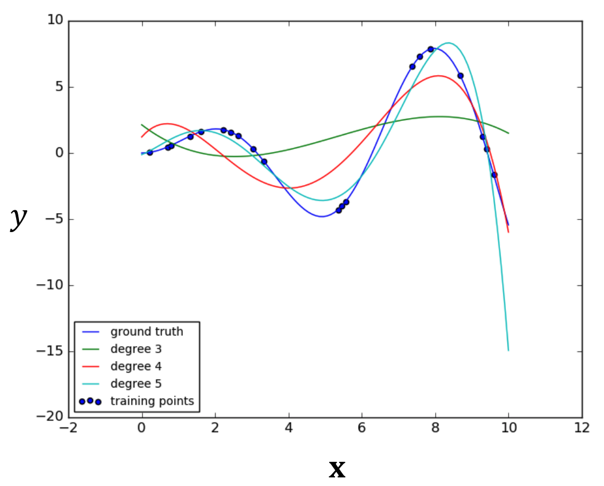

можно перейти от линейной регрессии к полиномиальной, то есть приближать полиномом. добавляем в датасет полиноммиальные фичи, регрессия при этом остается линейной.

$$
X \rightarrow Z
$$

$$
x \rightarrow [1, x, x^2]
$$

$$
[x_1, x_2] \rightarrow [1, x_1, x_2, x_1^2, x_2^2, x_1x_2]
$$

$$\text{и так далее...}$$

### пример

что будет, если переборщить в полиномами. вроде как все точки лежат на итоговой функции, но $E_{out}=MSE$ увеличивается.

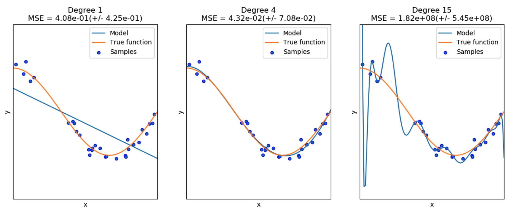

### синус

приближаем константой и линейной (желтое = $E_{out}$).

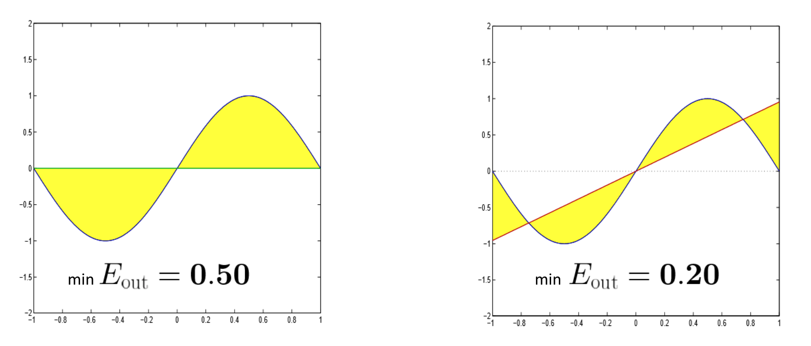

теперь посмотрим не на всю функцию, а на некоторые точки (так как обычно у нас есть просто датасет).

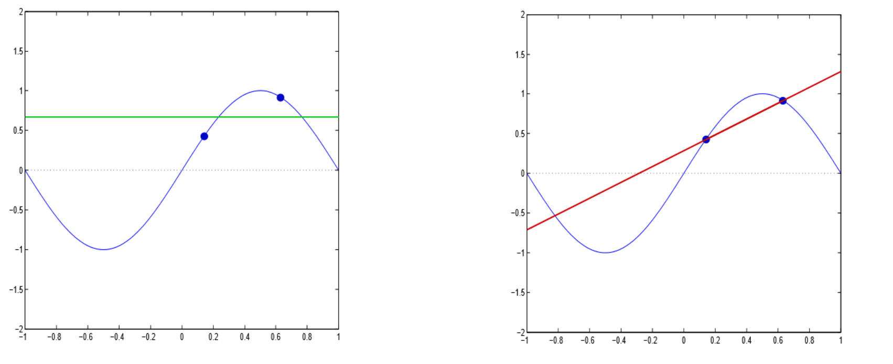

## смещение и дисперсия

для того, чтобы описать происходящее, можно использовать *смещение (bias)* и *диспресия (variance)*. будем оценивать $E_{out}$.

$$E_{out}(h^D)=\mathbb{E}_{\mathbf{X}} \left[ (h^D(\mathbf{x}) - f(\mathbf{x}))^2 \right],\quad \text{D – data}$$

смотрим, какой $E_{out}$ будем у гипотезы, построенной на конкретном датасете. смотрим, какой разброс будем в зависимости от датасета.

$$\mathbb{E}_D[E_{\text{out}}(h^D)] = \mathbb{E}_{\mathbf{X}} \left[ \mathbb{E}_D \left[ (h^D(\mathbf{x}) - f(\mathbf{x}))^2 \right] \right]=\mathbb{E}_D \left[ \mathbb{E}_{\mathbf{X}} \left[ (h^D(\mathbf{x}) - f(\mathbf{x}))^2 \right] \right]$$

вводим такое понятие как *средняя гипотеза (mean hypotesis)* – матожидание по всем датасетам, просто число, не зависящее от конкретного датасета.

$$\bar{h}(\mathbf{x}) =\mathbb{E}_D\left[ h^D(\mathbf{x}) \right]$$

про эту гипотезу мы будем говорить, что она близка к идеальной гипотезе, будто бы она проходилась по всем точкам датасета.

$$
\mathbb{E}_D \left[ (h^D(\mathbf{x}) - f(\mathbf{x}))^2 \right] = \mathbb{E}_D \left[ (h^D(\mathbf{x}) - \bar{h}(\mathbf{x}) + \bar{h}(\mathbf{x}) - f(\mathbf{x}))^2 \right] =
$$

$$
= \mathbb{E}_D \left[ (h^D(\mathbf{x}) - \bar{h}(\mathbf{x}))^2 + (\bar{h}(\mathbf{x}) - f(\mathbf{x}))^2 + 2 (h^D(\mathbf{x}) - \bar{h}(\mathbf{x})) (\bar{h}(\mathbf{x}) - f(\mathbf{x})) \right] =
$$

$$
= \mathbb{E}_D \left[ (h^D(\mathbf{x}) - \bar{h}(\mathbf{x}))^2 \right] + (\bar{h}(\mathbf{x}) - f(\mathbf{x}))^2
$$

получили, что матожидание по датасету – некоторые скобки. они как раз и зовутся *bias* (матожидание разницы между средней гипотезой и истинной гипотезой по датасету – некоторая возможная, минимальная ошибка, которую можем получить, насколько можем приблизиться к идеальной гипотезе) и *variance* (матожидание матожидание отличия гипотезы, полученной на датасете, от средней гипотезы – насколько может быть разброс на конкретном датасете).

$$
\mathbb{E}_D \left[ (h^D(\mathbf{x}) - f(\mathbf{x}))^2 \right] = \mathbb{E}_D \left[ (h^D(\mathbf{x}) - \bar{h}(\mathbf{x}))^2 \right] + (\bar{h}(\mathbf{x}) - f(\mathbf{x}))^2
$$

можно записать в таком виде:

$$
\mathbb{E}_D[\mathbb{E}_{\text{out}}(h^D)] = \mathbb{E}_{\mathbf{X}} \left[ \mathbb{E}_D \left[ (h^D(\mathbf{x}) - f(\mathbf{x}))^2 \right] \right]=
$$

$$
= \mathbb{E}_{\mathbf{X}} \left[ \text{variance}(\mathbf{x}) + \text{bias}(\mathbf{x}) \right] = \text{bias} + \text{variance},
$$

где:

$$\text{bias} = \mathbb{E}_{\mathbf{X}} \left[ (\bar{h}(\mathbf{x}) - f(\mathbf{x}))^2 \right],\quad \text{variance} = \mathbb{E}_{\mathbf{X}} \left[ \mathbb{E}_D \left[ (h^D(\mathbf{x}) - \bar{h}(\mathbf{x}))^2 \right] \right]
$$

### пример с bias и variance

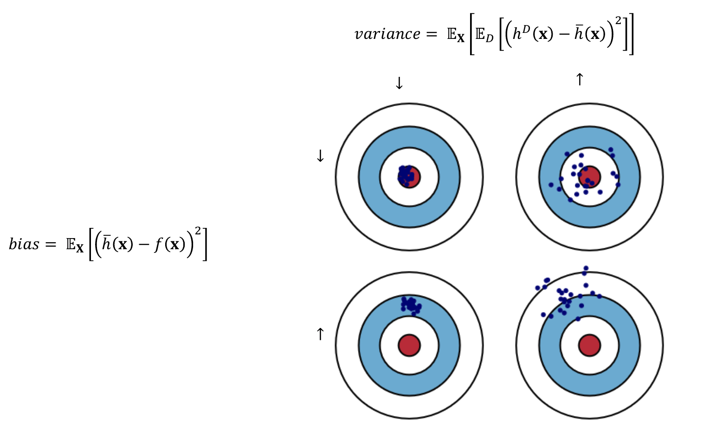

1. **верхний левый угол:**
   - низкое смещение, низкий разброс: Все попадания сосредоточены точно в центре мишени, представляя идеальный сценарий, где модель точна и стабильна.

2. **верхний правый угол:**
   - высокое смещение, низкий разброс: Все попадания находятся близко друг к другу, но отклонены от центра. Это означает, что модель предсказуема, но систематически ошибается.

3. **нижний левый угол:**
   - низкое смещение, высокий разброс: Попадания раскиданы по мишени, но центр мишени находится в среднем положении. Модель имеет высокую изменчивость, но может быть близка к правильным результатам в среднем.

4. **нижний правый угол:**
   - высокое смещение, высокий разброс: Попадания раскиданы и отклонены от центра, представляя случай, когда модель неверна и нестабильна.

### как оценить bias и variance

$$
E_{in} = E_{train}\ –\ bias,\quad E_{val} \approx E_{out},\ variance = E_{train} - E_{val}
$$

какая ситуация лучше – высокий variance и низкий bias или наоборот?

**ответ:** недостаточно информации, неясно, как исправить. при высоком bias нужно менять класс гипотез, пытаться подобрать другую гипотезу. при высоком variance его можно как-то уменьшить разными способами.

### пример для синуса

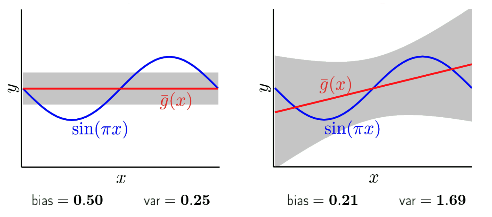

### зависимость bias и variance

при высоком bias можно менять модель – усложнять, добавлять полиномиальные фичи, но во втором случае увеличивается variance.

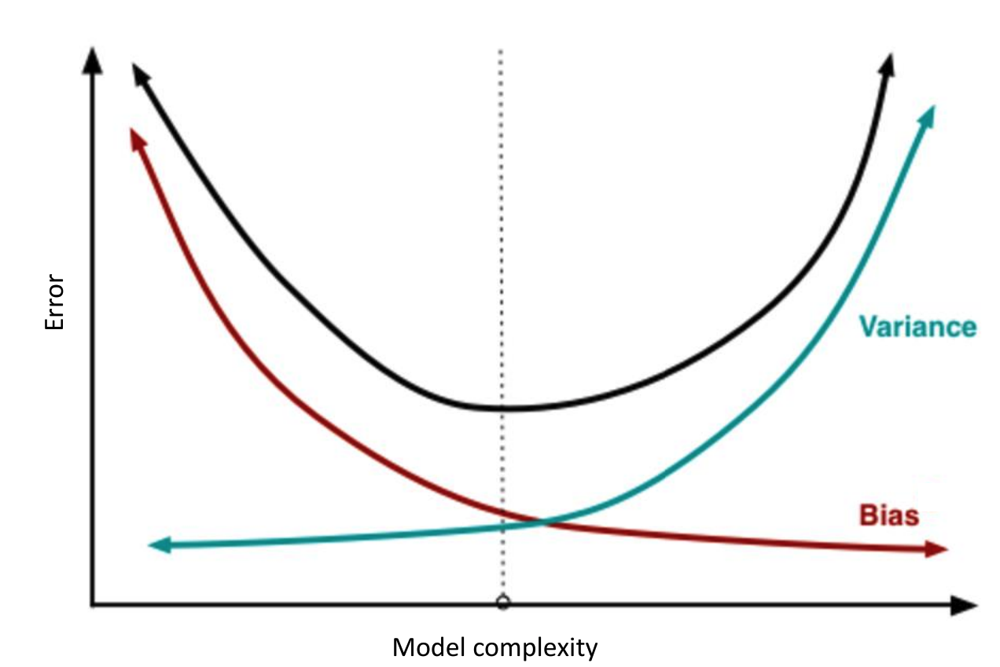

## регуляризация

способ уменьшения variance.

## L2 reqularization

добавляем некий штраф за коэффициенты.

$$
L_{linear}(\mathbf{w}) = \| \mathbf{X}\mathbf{w} - \mathbf{y} \|_2^2
$$

$$
L_{ridge} = L_{linear}(\mathbf{w}) + \alpha \mathbf{w}^T \mathbf{w} = (\mathbf{X}\mathbf{w} - \mathbf{y})^T (\mathbf{X}\mathbf{w} - \mathbf{y}) + \alpha \mathbf{w}^T \mathbf{w}
$$

$$
\nabla L_{ridge}(\mathbf{w}) = 2(\mathbf{X}^T (\mathbf{X}\mathbf{w} - \mathbf{y}) + \alpha \mathbf{w}) = 0
$$

$$
\mathbf{w} = (\mathbf{X}^T \mathbf{X} + \alpha \mathbf{I})^{-1} \mathbf{X}^T \mathbf{y}
$$

### пример с синусом

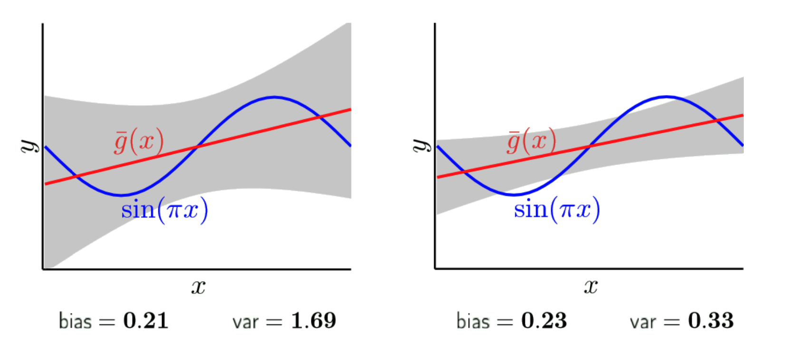

### overlifting и underlifring

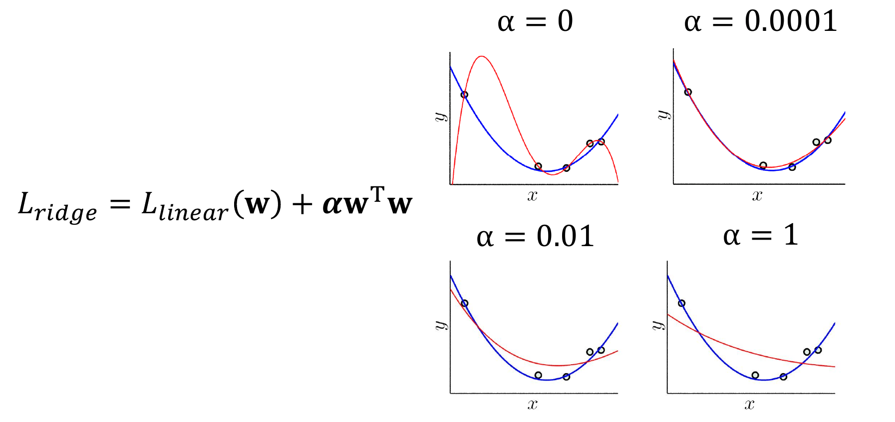

при увеличении $\alpha$ приоритизация уходит в коэффициенты, пытаясь сделать более прямую кривую, нежели угадать саму функцию.

*переобучение (overlifting)* – переобучились на конкретный датасет.

*недообучение (underlifting)* – недообучились.

### гребневая регрессия (ridge regression)

$$
L_{ridge} = \|\mathbf{X}\mathbf{w} - \mathbf{Y}\|_2^2 + \alpha \|\mathbf{w}\|_2^2
$$

$$
\mathbf{w} = (\mathbf{X}^T \mathbf{X} + \alpha \mathbf{I})^{-1} \mathbf{X}^T \mathbf{Y}
$$

при уменьшении $\alpha$ коэффициенты (веса) растут (некоторые при этом могут быть знакопеременными, но такое чаще всего означает переобучение).

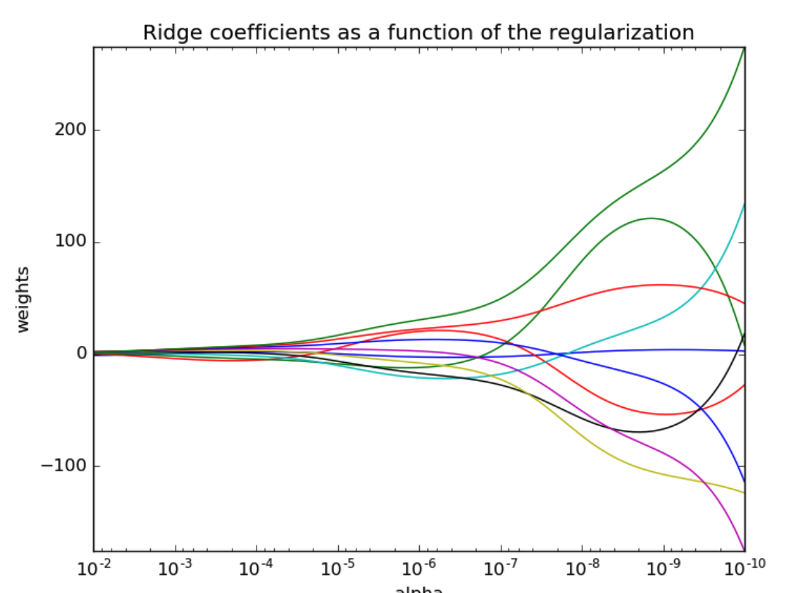

## L1 регуляризация и LASSO (Least Absolute Shrinkage and Selection Operator)

прибавляем абсолютные значения весов. происходит некий обмен признаков.

$$
L_{lasso} = \|\mathbf{X}\mathbf{w} - \mathbf{Y}\|_2^2 + \alpha \|\mathbf{w}\|_1
$$

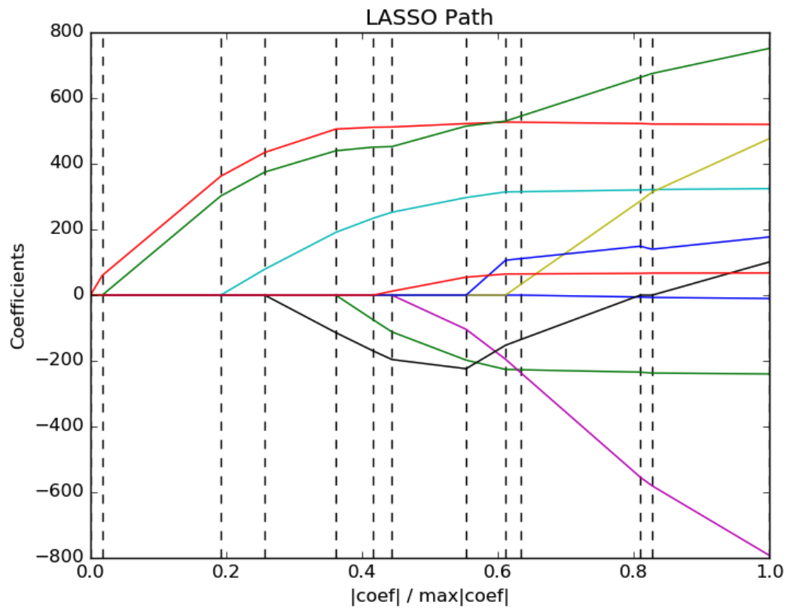

## LARS (Least Angle Regression)

наибольшую корреляцию имеют вектора с наименьшим углом.

1. берем одну фичу $x_i$, который имеет наибольшую абсолютную корреляцию с $y$.
2. вводоим коэффициент $\beta_1$ как множитель для $ x_i $ и увеличиваем его (или уменьшаем, если корреляция отрицательная), пока корреляция $ x_i $ с остатком $ r = y - \hat{y} $ не станет максимальной.
3. в точке, где условие из пункта 2 нарушается, мы получаем новую фичу $ x_j $ с той же корреляцией.
4. вводим $\beta_2$ как множитель для $ (x_i \pm x_j)^* $.
5. $\rightarrow 2$
6. останавливаемся, когда увеличение суммы коэффициентов (умноженных на $\alpha$) становится меньше, чем уменьшение ошибки.

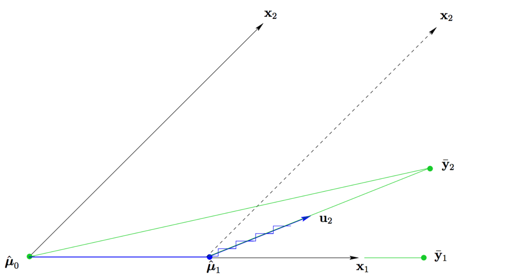

## Elastic Net

объединение этих способов – elastic net.

$$
L_{elastic} = \|\mathbf{X}\mathbf{w} - \mathbf{Y}\|_2^2 + \alpha (1 - \text{l1\_ratio}) \|\mathbf{w}\|_2^2 + \alpha (\text{l1\_ratio}) \|\mathbf{w}\|_1
$$

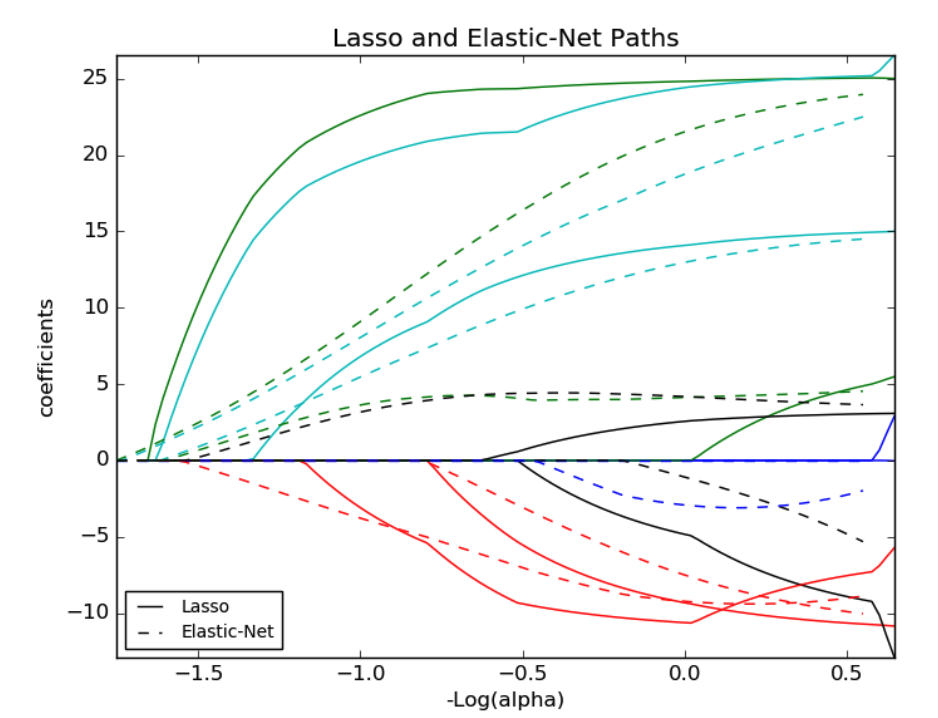

## $R^2$-score

полезная метрика для регрессии.

$$
R^2 = 1 - \frac{u}{v}
$$

$$
u = \sum (h(x_i) - y_i)^2,\quad v = \sum (\bar{y} - y_i)^2,\quad \bar{y} = \frac{1}{N} \sum y_i
$$

хуже всего, когда $R^2 \leq 0$ (переобучились).