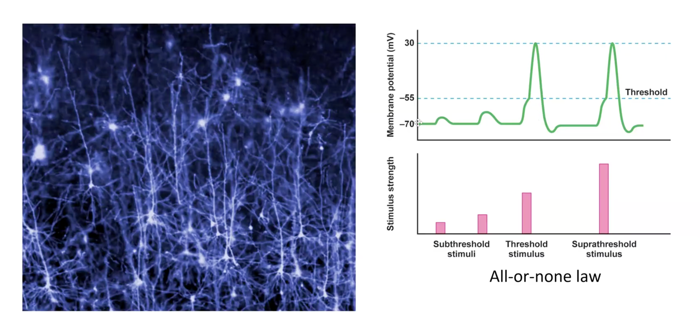
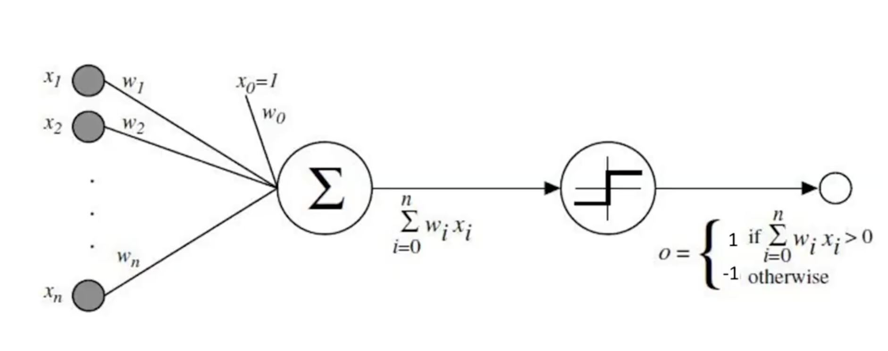
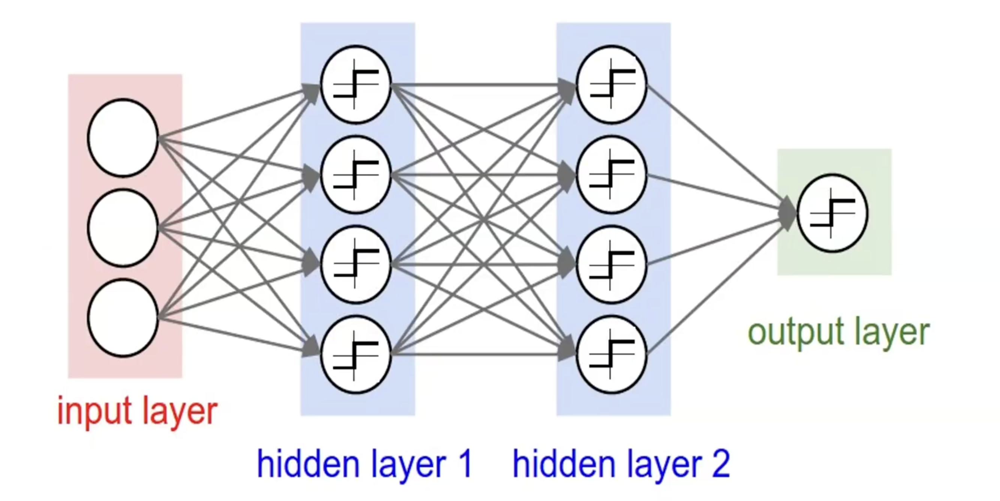
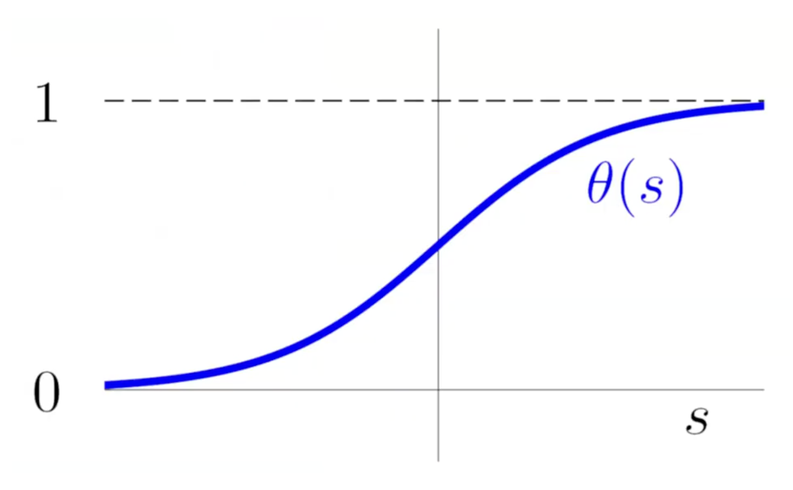
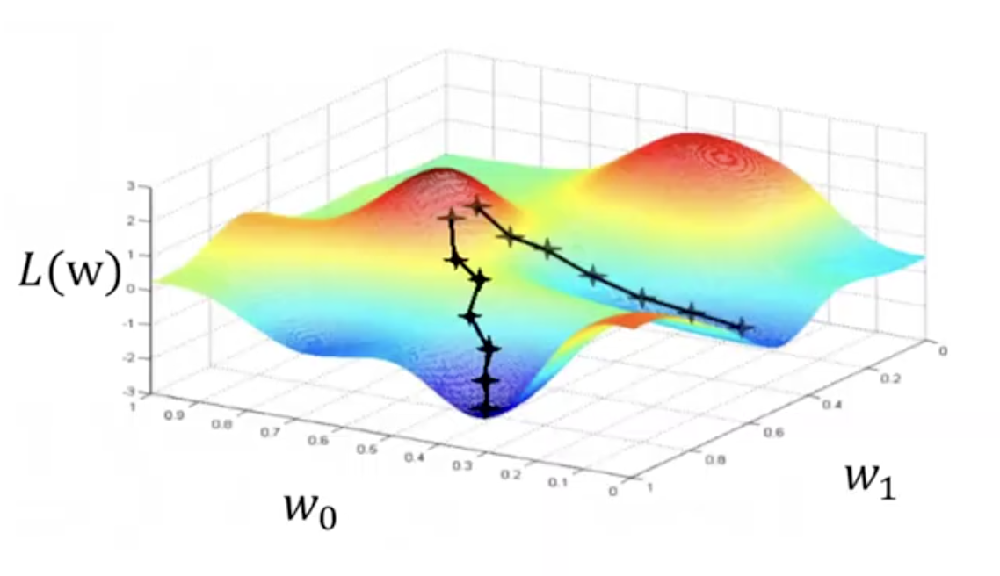
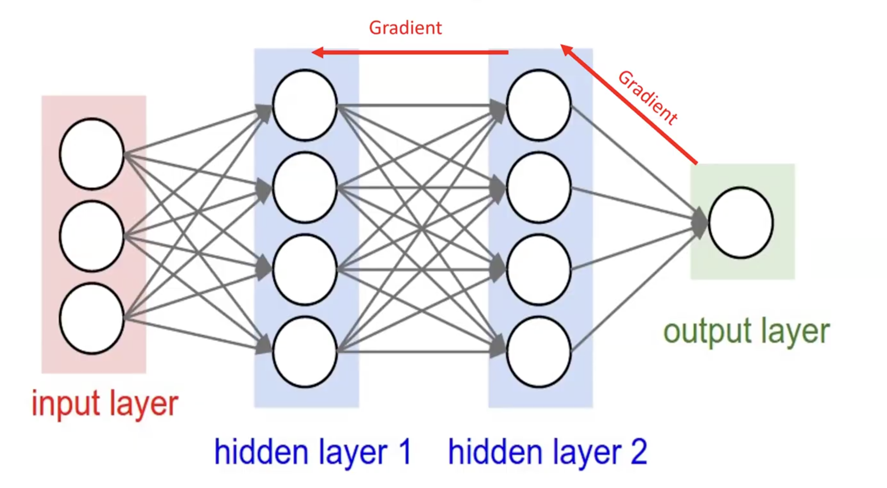
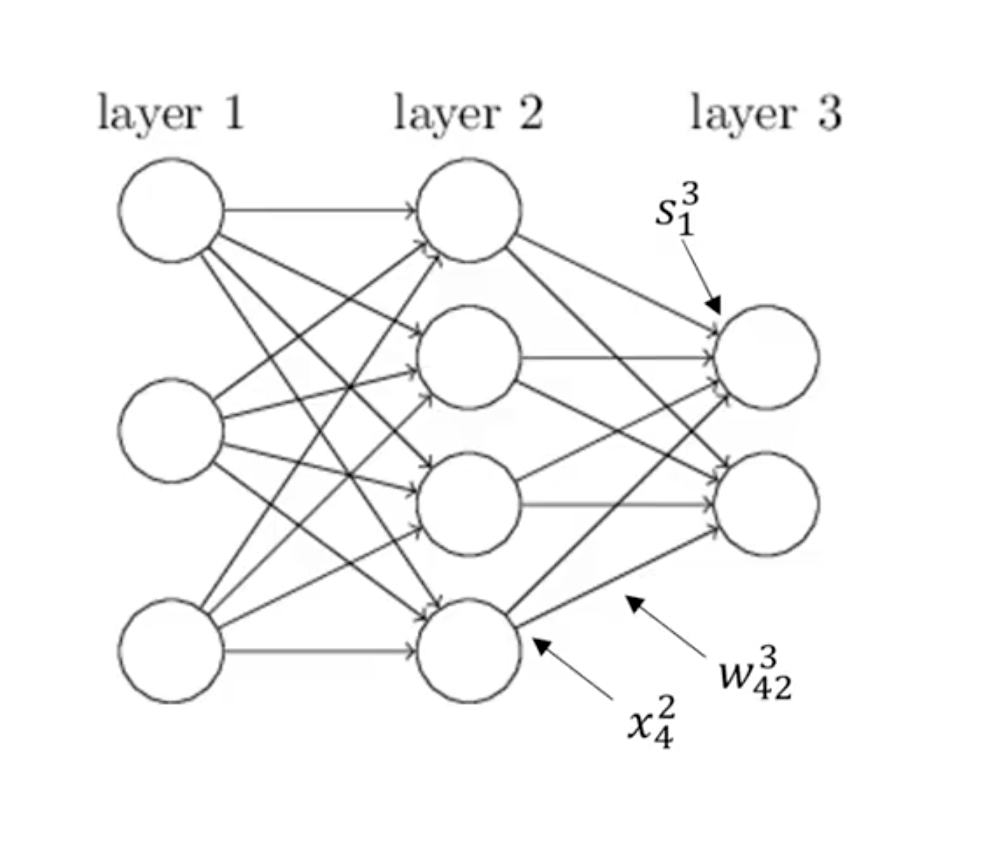
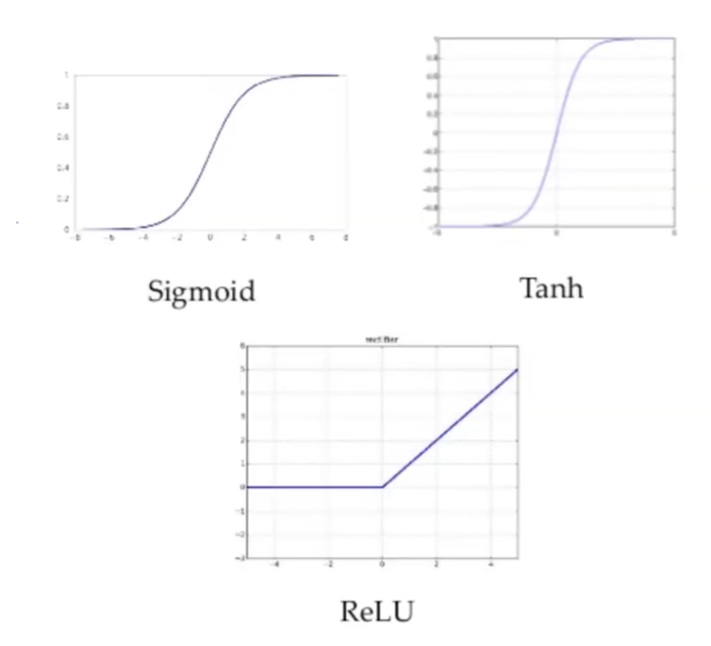
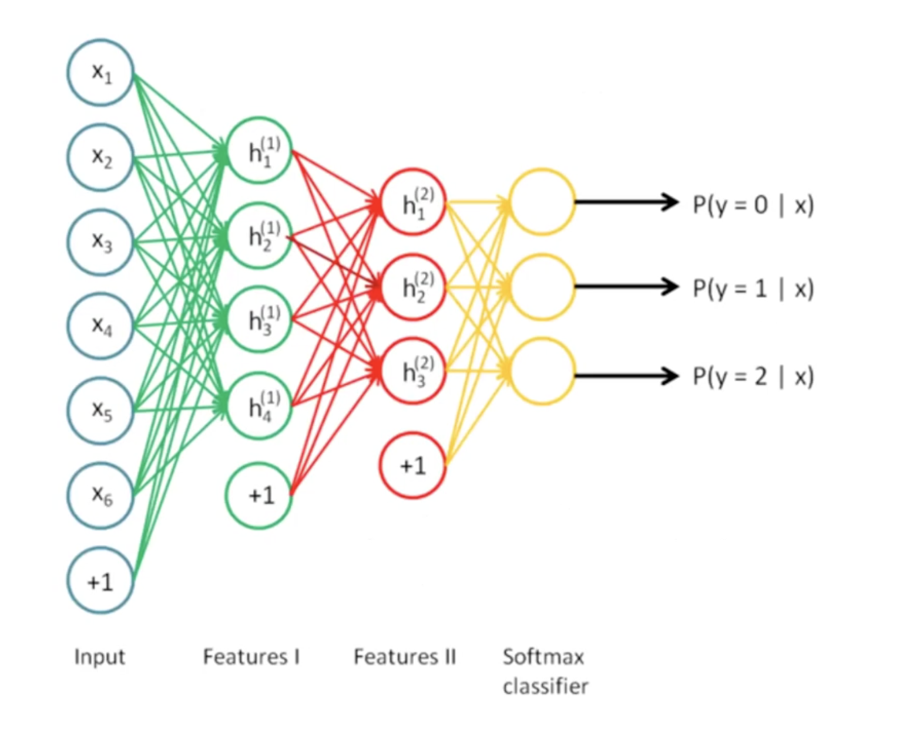

<!-- 2024-10-21 -->
# нейронные сети

## биологические нейронные сети

нейронки вдохновлены биологическими нейронными сетями

справа эксперимент – взяли нейрон и подавали на него электрический сигнал. внизу размер электрического импульса, подававшегося на нейрон, сверху его аннеруация (??).

если импульс подавался чуть-чуть, то его и наблюдаем. больше – реакция больше. при этом если импульс преодолевал до какого-то граничного значения, то происходила аннеруация и сам электрон начинал вырабатывать электрический ток. дальнейшее увеличение импульса не приводит к увеличению сигнала (*закон «все или ничего», law all-or-none*).

## однослойный перцептрон, perceptron

$$
\text{sign}(\mathbf{w}^\top \mathbf{x}_n) \neq y_n
$$
$$
\mathbf{w} \leftarrow \mathbf{w} + y_n \mathbf{x}_n
$$

такая логика была у перцептрона – брали $x_i$, умножали на $w_i$ (считаем это неким входным сигналом), если он преодолевал какой-то трешхолд (получили нужный знак результата), то сигнал дальше шел, иначе не шел.

## многослойный перцептрон, multi-layer perceptron (MLP)

однослойный перцептрон очень сильно ограничивает набор функций, которые можно реализовать, поэтому перешли к многослойному (1969).

## логистическая функция (сигмоид), logistic function (sigmoid)

но потребовалось еще лет 15, чтобы найти подходящую функцию и способ обучения чего-то более сложного, чем многослойный перцептрон.

так появилась *логистическая функция или сигмойд*. она принимает значения от 0 до 1, поэтому принимаем ее значение за вероятность принадлежности какому-то положительному классу.

$$
P(y \mid \mathbf{x}) =
\begin{cases}
f(\mathbf{x}) & \text{for } y = +1; \\
1 - f(\mathbf{x}) & \text{for } y = -1.
\end{cases}
$$
$$
\sigma(s) = \frac{1}{1 + e^{-s}}
$$

хорошее свойство:

$$
\sigma(-s) = 1 - \sigma(s)
$$

## логистическая регрессия, logistic regression

это алгоритм классификации.

благодаря этому свойству можно считать, что $\sigma(ys)$ – вероятность, что класс $y$:
$$
P(y \mid \mathbf{x}) = \sigma(y \, \mathbf{w}^\top \mathbf{x})
$$

### как обучать?

нужно ввести меру, насколько хорошо подобрали функцию $\mathbf{w}$. можно попытаться делать классификацию, но тогда нам важно, условно говоря, соотношение с 0.5 (принадлежность к некому классу), а мы хотим, чтобы вероятность правильного класса была как можно ближе к 1, вероятность неправильного класса –как можно ближе к 0.

это хорошо выражается *функцией правдоподобия* (произведение вероятностей правильных классов):
$$
\text{Likelihood: } \prod_{i=1}^{N} P(y_i \mid \mathbf{x}_i) = \prod_{i=1}^{N} \sigma(y_i \mathbf{w}^\top \mathbf{x}_i)
$$

## логистическая функция правдоподобия, logistic regression loss fucnction

чтобы перейти от произведения к сумме возьмем логарифм, а чтобы перейти к подсчету ошибки (искать что-то «чем, меньше, тем лучше») возьмем со знаком минус. получили *функцию ошибки negative log likehood loss (NLLL)*:
$$
L(\mathbf{w}) = -\frac{1}{N} \ln \left( \prod_{i=1}^{N} \sigma(y_i \mathbf{w}^\top \mathbf{x}_i) \right) = \frac{1}{N} \sum_{i=1}^{N} \ln \left( \frac{1}{\sigma(y_i \mathbf{w}^\top \mathbf{x}_i)} \right)
= \frac{1}{N} \sum_{i=1}^{N} \ln(1 + e^{-y_i \mathbf{w}^\top \mathbf{x}_i})
$$

это пример, когда сама ошибка и loss-функции заметно разные по концепции.

**!! отсюда и дальше будем стараться делать loss-функции:**

- коррелирующими с ошибкой (чем меньше loss-функция, чем она ближе к 0, тем меньше будет ошибка – вероятность будет ближе к 1, у неправильных к 0, можно выставить трешхолд и получить больше примеров с нужной стороны).
- дифференцируемыми (такие функции понятно как минимизировать ее и, следовательно, и ошибку).

## градиентный спуск, gradient descent

$$
\mathbf{w}(t + 1) = \mathbf{w}(t) - \eta \frac{\partial L(\mathbf{w})}{\partial \mathbf{w}}
$$

у *градиентного спуска* идея простая: для минимизации функции выберем случайную точку, считаем градиент (это вектор, показывающий в сторону наибольшего увеличения функции). чтобы не скатать туда-сюда по векторному пространству будем идти маленькими шажками (умножаем на $\eta$ – *скорость обучения, learing rate*). такими шажками потихоньку спускаемся в минимум.

для подсчета $L(w)$ нужно сложить $n$ логарифмов, это может быть напряжно. если данных много, то вычисление по всем точкам может не влезать в память. тогда вместо градиентного спуска можно использовать *стохастический градиентный спуск, stochastic gradeint descent* – подсчитывать $L(w)$ на некоторой *подвыборке, batch*. берем датасет, делим на батчи, на каждом вычисляем градиент, после каждого вычисления делаем шаг.

когда мы сделали шаги по всем батчам датасета, то мы закончили *эпоху, epoch*. шагов в эпохе – $\frac{N_{dataset}}{N_{batch}}$.

**градиентный спуск:**
$$
\mathbf{w} \leftarrow \mathbf{w} - \eta \left( -\frac{1}{N} \sum_{i=1}^{N} \frac{y_i \mathbf{x}_i}{1 + e^{y_i \mathbf{w}^\top \mathbf{x}_i}} \right)
$$

**стохастический градиентный спуск:**
$$
\mathbf{w} \leftarrow \mathbf{w} - \eta \left( -\frac{1}{N_{\text{batch}}} \sum_{\mathbf{x}_i \in \text{batch}} \frac{y_i \mathbf{x}_i}{1 + e^{y_i \mathbf{w}^\top \mathbf{x}_i}} \right)
$$

**очень стохастический градиентный спуск (считаем в каждой точке датасета):**
$$
\mathbf{w} \leftarrow \mathbf{w} - \eta \frac{\partial L(\mathbf{w}^\top \mathbf{x}_i, y_i)}{\partial \mathbf{w}}
$$

это однослойная логистическая регрессия.

## обратное распространение, back-propogation

обратное распространение градиента (1986).

**в нейронке у нас есть:**

- слои (начинаем с первого и заканчиваем на $L$).
- $w_{jk}^l$ – вес между нейроном $j$ в слое $l-1$ и нейроном $k$ в слое $l$.

- $s_j^l$ – входной сигнал к нейрону $j$ в слое $l$.
    $$
    s_j^l = \sum w_{ij}^l x_i^{l-1}
    $$
- $x_j^l$ – исходящий сигнал после функции активации.
    $$
    x_j^l = \sigma(s_j^l) = \sigma\left(\sum w_{ij}^l x_i^{l-1}\right)
    $$

$x_j^1 = x_j$ – это наши фичи. следующие $x_j^l$ – что-то более сложное (хотя некоторый зовут это более высокоуровневыми фичами и считают, что нейронка может сама себе генерить фичи, вопрос философский).

наша задача – посчитать функцию потерь по конкретному $w$, чтобы узнать, в какую сторону, меньшую или большую, сдвигать этот $w$. в силу того, что...:
$$
\frac{\partial s_j^l}{\partial w_{ij}^l} = x_i^{l-1},\quad
\frac{\partial L(w)}{\partial s_j^l} = \delta_j^l\text{ (просто обозначение)}
$$

...сделаем некое преобразование – *производная сложной функции, chain rule*:
$$
\nabla L_{w_{ij}^l}(w) = \frac{\partial L(w)}{\partial w_{ij}^l} = \frac{\partial L(w)}{\partial s_j^l} \times \frac{\partial s_j^l}{\partial w_{ij}^l}
$$

начнем с последнего слоя (тут $L$ и функция потерь (если это $L(w)$), и номер последнего слоя (индекс в $\delta$)). функция ошибка – некая функция последнего слоя, все дифференцируемо. поэтому можем посчитать $\delta_i^L$:
$$
\delta_i^L = \frac{\partial L(w)}{\partial s_i^L},\quad
L(w) = f(x^L),\quad
x_i^L = \sigma(s_i^L)
$$

$\delta^{l-1}_i$ будет вычислять через слудующие дельты (поэтому метод обратного распространения):
$$
\delta_i^{l-1} = \frac{\partial L(w)}{\partial s_i^{l-1}} = \sum_j \frac{\partial L(w)}{\partial s_j^l} \times \frac{\partial s_j^l}{\partial x_i^{l-1}} \times \frac{\partial x_i^{l-1}}{\partial s_i^{l-1}}
= \sum_j \delta_j^l \times w_{ij}^l \times \sigma'(s_i^{l-1})
$$

### алгоритм back-propogation

1. рандомно инициализируем веса.
2. прямой проход: вычисление $x$ и $s$.
3. обратный проход: вычисление $\delta$.
4. градиентный шаг: $w_{ij}^l \leftarrow w_{ij}^l - \eta x_i^{l-1} \delta_j^l$
5. вернуться к шагу 2.

## функции активации, activation functions

- *sigmoid:*
  $$\sigma(s) = \frac{1}{1 + e^{-s}}$$

- *tanh:*
  $$\sigma(s) = \frac{e^s - e^{-s}}{e^s + e^{-s}}$$

- *rectified linear unit (ReLU):*
  $$\sigma(s) = \max(0, s)$$

  нужна для упрощения вычислений.

## функции на выходных нейронах, softmax и cross-entropy

для бинарной классиикации на выходе может быть один нейрон, отвечающий за принадлежность классу. тогда на выходе стоит один сигмойд.

для линейной регрессии на выходе может быть одно число, ошибка MSE.

мультиклассовая классификация – на выходе много нейронов, каждый отвечает за вероятность принадлежности своему классу. на выходе должна быть функция, которая в сумме по всем нейронам дает единицу – *softmax*, похоже на обобщение сигмойды на мультиклассовую классификацию:
$$
x_j^L = \sigma^L(s_j^L) = \frac{e^{s_j^L}}{\sum e^{s_i^L}}
$$

функция ошибки, куда приписали классификатор, cross-entropy:
$$
L(w) = -\sum o_i \log(x_i^L),\quad o_i = \begin{cases}
   1, & \text{если } y = i \\
   0, & \text{если } y \neq i
   \end{cases}
$$

## регуляризация

- *L2-регуляризация*
  $$
  L'(w) = L(w) + \frac{\lambda}{2N} \|w\|_2^2
  $$

  weight decay – распад весов – каждый шаг = градиентный шаг + уменьшение веса.

- *ранняя остановка, early stopping*

  

  если посмотрим на эпохи в процессе обучения, то на обучающей выборке функция потерь уменьшется, на валидационной в какой-то момент она начинает расти (происходит переобучение). можно остановиться раньше, например, на 10й эпохе. тогда на рабочем датасете в продакшене (тренировчный + валидационный) можно провести обучение на запомненном количестве эпох.

  так делают часто – используют валидационную выборку, чтобы подобрать гиперпараметры, найти количество эпох, найти коэффициент регуляризации и так далее. а потом с найденными параметрами обучаться в продакшене на объединенной выборке.

**пример переобучения:** парсим кошку на картинке, если данных мало, а сетка большая, то сетка может поставить большие веса на пути одного нейрона конкретному пикселю и тогда будет по этому пикселю определять, кошка ли на картинке.

- *dropout* – во время обучения выключаем нейроны (из него всегда выходит 0). применять такую сетку нельзя – входной сигнал становится меньше, а при включении обратно он увеличится и сетка не будет работать. поэтому вес оставшихся нейронов умножается на $\frac{N}{N-N_{out}}$

### deep learning libraries

1. TensorFlow (<www.tensorflow.org>) + Keras (keras.io)
2. Torch (torch.ch)
3. Deeplearning4j (deeplearning4j.org)

лучше знать и 1, и 2, в каждом есть свои инструменты, заточенные под разные задачи.
