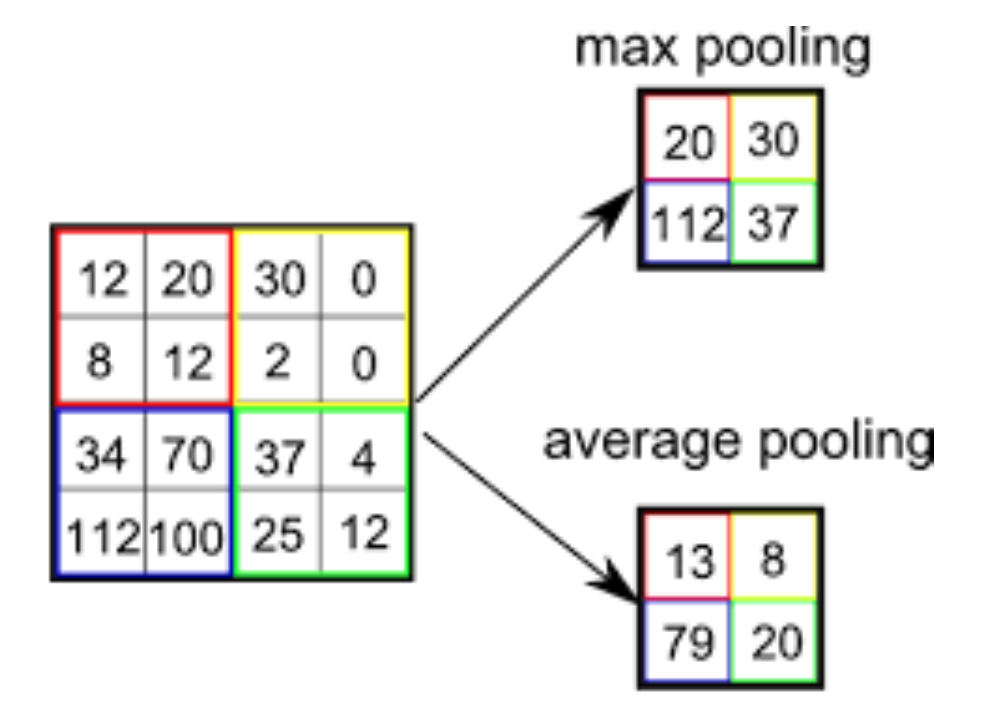

<!-- 2024/11/11 -->
# глубокое обучение, deep learning

проблема полносвязных многослойных сеток – квадратичная зависимость числа связей от количества нейронов. раньше это было большой проблемой, так как не было нормальных вычислительных мощностей.

## свертка, convolution

на помощь пришла подсказка из биологии – есть нейроны, которые реагируют на вполне себе конкретные простые формы. отсюда возникло предположение, что простые формы складываются в сложные и зрение происходит таким образом: на низком уровне нейронной деятельности обрабатываются простые формы, а дальше мы видим образы, которые складываются из этих простых форм (видим не пикселями).

математическая аналогия – операция свертки (convolution). применением свертки из исходного изображения генерируются сверточные признаки (convolved features), картинка меньшего размера с сохранением геометрии. к слову, для цветных картинок свертка будет трехмерной (три канала), накладываем куб.

можно брать много таких картинок (диагональные, вертикальные и так далее линии) и сворачивать их.

ядро свертки (kernel) – его размеры (например, 3х3), шаг свертки (stride) – на сколько сдвигаемся во время свертки (изображение кратно сжимается).

### примеры

#### базовые свертки

1. возвращает исходное изображение.
2. засекает диагональные линии, наклоненные влево.
3. засекает все границы.

#### alex net

#### слои свертки

на первом слое получаем простые формы, дальше образуется что-то более сложное.

вопрос следующий: какие свертки использовать? чудо машинного обучения – сначала задаем числа случайно, запускаем, получаем шум, который мы знаем, куда двигать. зная результат (к какому классу нужно было отнести все), запускаем обратно градиент, получаем в результате нужные свертки.

## pooling

pooling – способ уменьшить количество чисел, сжать сетку, сохранив сигнал.

из каждой области берем максимум или среднее (используется реже). сохраняем сигнал, но сжимаем сетку. размер ядра 2х2, шаг 2.

## padding

есть проблема обрезания краев, берется не вся картинка. чтобы не потерять картинки на краях, к исходному изображению добавляется рамка шириной в половину свертки (чтобы центр свертки попадал в первый пиксель).

! размер свертки в основном нечетный.

## разные сетки

### LeNet

всего 61 тысяча нейронов, в полносвязной было бы около 120 тысяч.

### AlexNet

- масштабирует все изображения до 256x256 (так как изначальные изображения разного размера), затем случайным образом берет фрагменты 224x224 (миллиона от ImageNet мало) и зеркально отражает их.
- вычитает среднее значение пикселя из каждого пикселя.
- ReLU ($f(x) = \max(0,x)$)
- Dropout 0.5
- размер батча 128, SGD с моментумом (0.9), L2-регуляризация ($\lambda = 0.0005$)

разветвеление тут нужно для высчитывания на двух разных gpu. на первой преобладали черно-белые свертки, на второй цветные.

### ImageNet challenge

проблема недостатка данных была решена таким челленджем: собрали миллион картинок, разметили на тысячу классов с помощью людей, а после на полученных данных проводили тест для моделей – 1.2 миллиона тренировочного датасета, 100 тысяч тестового, модели дается 5 попыток на распознание картинки, считается итоговая точность (попадание = угадывание хотя бы одной попыткой).

классические методы компьютерного зрения (без использования сеток) до 2012 года давали максимально около 75% точности. после 2012 года с помощью глубокого обучения получилось к 2015 году увеличить точность до 95%.

### very deep convolutional networks (VGGNet)

поняли, что не нужные никакие свертки кроме сверток 3х3: если представить свертку 3х3 как результат операций предыдущей свертки 3х3, то двумя свертками можем заменить свертку 7х7 за 27 операций. а чистая свертка 7х7 дает 49 операций.

### inception (google, 2014)

у гугла есть стиль «давайте закидаем все деньгами».

зачем свертка 1х1: на самом деле, это не просто 1х1, это 1х1х[сколько-то], поэтому это хороший способ менять количество слоев и получать фичи из комбинации признаков в одном месте. также можно менять количество каналов.

### GoogLeNet

добавили сетки 1х1, сделали несколько выходных слоев и усредняли ответ.

## residual learning

несколько выходов помогли сохранить информацию, которая теряется, если делать много сверток (иначе бы это было бессмысленно). чтобы переносить исходную информацию, сделаем свертку, которая будет складываться с входными данными.

### ResNet (2015)

тогда можно делать очень большие сетки.

так достигли ошибки 3.5%. и на это все закончилось, потому что человеческая точность на датасете с 5 попытками около 5%. а сетка может начать оттачиваться под конкретных разметчиков.

## transfer learning

если денег не очень много, а датасет не сильно большой, то можно применить transfer learning: возьмем сетку, обученную людьми, у которых много денег и много данных и которые выложили сетку в опенсорс (таких много), отрежем кусочек и вставим другой кусочек и не будем трогать предобученные куски. а на маленьком датасете обучим наш кусочек.

если хочется обучаться, то можно обученную сетку разморозить и дообучить (finetuning), но learning rate должен быть ниже, чем на маленьком датасете (иначе обученная сетка просто выучит его)

## применение сеток

### сегментация изображений и U-Net

U-Net, потому что выглядит как буква U.

к слову, это уже похоже на генерацию картинок.

### Variational Autoencoder (VAE)

сжимаем картинку в ее представление, тогда сетка в декодере выучиваем признаки лица (цвет волос, глаз или так далее), а в слое – определение позы и черт. так делали изначально deep fake.

### генеративные состязательные сети, Generative Adversarial Network (GAN)

теперь берем случайный вектор и генерим из него изображение, но нужна какая-то ошибка. для этого берут вторую сетку, которая будет определять, сгенеренное или реальное изображение. сетки соревнуются: одна генерит так, чтобы казалось, что это реальное изображение, вторая пытается понять, что изображение реально сгенеренное.

### diffusion network

будем восстанавливать картинки, удалять шум. одной и той же сеткой зашумим и восстановим и так несколько раз. в какой-то момент можем получить почти полный шум.

тогда можно давать шум на вход и толкать в какую-то сторону (conditional generate) – получили генерацию изображений.

